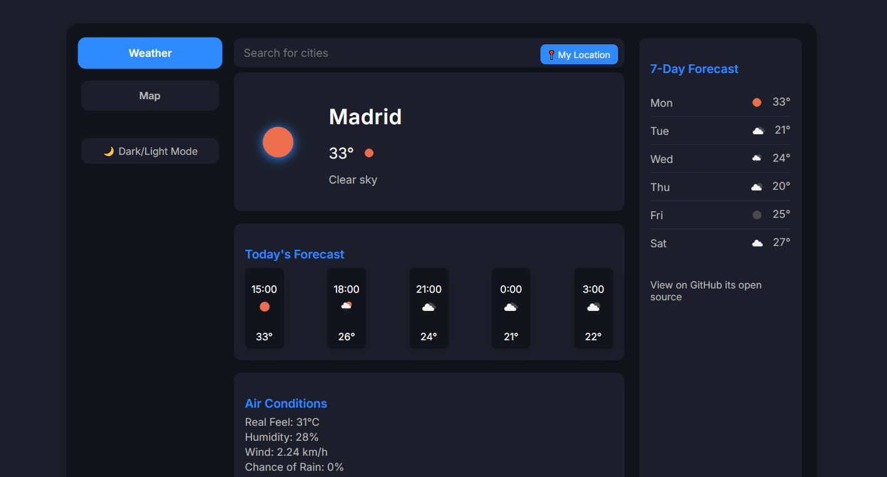

# 🌤️ Weather App

A clean, modern, and responsive weather web application that shows real-time weather data, forecasts, air conditions, and more. Built with simplicity and user experience in mind, this app is ideal for anyone who wants quick access to detailed weather information.

## 🔍 Features

- 🔎 **City Search with Autocomplete**
- 📍 **Get Weather by Current Location**
- 🌡️ **Current Weather Info**
  - Temperature, Condition, City Name
  - Weather Icon with animation
- 🕒 **Hourly Forecast**
  - Next few hours in a scrollable grid
- 📅 **7-Day Forecast**
  - Full week weather summary
- 🌬️ **Air Conditions**
  - Wind speed, Humidity, Pressure, etc.
- 🌓 **Light/Dark Mode Toggle**
- 🗺️ **Map Integration (Optional)** *(add your own API key)*
- 📱 **Fully Responsive Design**

## 🛠️ Technologies Used

- HTML5
- CSS3 (Custom with modern design system)
- JavaScript (Vanilla)
- [OpenWeatherMap API](https://openweathermap.org/api)
- Optional: [Leaflet.js](https://leafletjs.com/) for map view

## 🚀 Getting Started

1. **Clone the repository**
   ```bash
   git clone https://github.com/Muhammad-Murtaazaa/Weather-App.git
   cd weather-app
   
## 📸 Screenshot


## 🧑‍💻 Contributing
Contributions are welcome! Feel free to submit issues, feature requests, or pull requests.

<h2>Made with ❤ and alot of ☕ for the web</h2>


